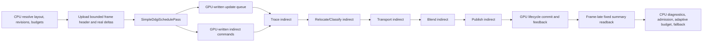

# GPU-Resident Simple-DDGI Scheduling Implementation Plan

- Status: Planned
- Date: 2026-08-03
- Target backend: Simple DDGI with ray-query transport V2
- Primary target profile: ShippingPerformance, 1080p, NVIDIA RTX 3060 Laptop GPU
- Primary performance gate: GI CPU scheduling/upload P95 at or below 0.25 ms

## 1. Required outcome

Make the GPU the sole production authority for Simple-DDGI probe eligibility,
priority, queue emission, lifecycle transitions, ray-count batching, and update
dispatch counts.

The completed production frame must have this shape:

- CPU resolves bounded global policy and uploads only a small frame header plus
  real layout, scene, lighting, environment, or dirty-region changes.
- GPU derives all per-probe scheduling state from persistent GPU records.
- GPU writes `GPUSimpleDdgiProbeUpdate` records directly into the existing update
  queue.
- GPU writes fixed `VkDispatchIndirectCommand` records consumed by trace,
  relocate/classify, transport, blend, publish, and scheduler-commit work.
- No same-frame scheduler readback influences rendering or command recording.
- A small, frame-late summary readback supplies diagnostics, atmosphere cohort
  feedback, adaptive-budget feedback, validation, and safe fallback decisions.
- The CPU reference scheduler remains available as a validation oracle and
  delayed fallback, but performs no stable-frame production work in GPU mode.

This work is complete only when the measured GI CPU P95 is at or below 0.25 ms
without violating request/ray budgets, dirty-response bounds, transport
convergence, relocation safety, toroidal ownership, or publication atomicity.

## 2. Evidence and baseline

The accepted baseline is the three identity-locked `final-v13` production runs
recorded in
[`Complete/NsightDdgiPerformancePassImplementationStatus-20260802.md`](Complete/NsightDdgiPerformancePassImplementationStatus-20260802.md).

| Metric | Run A | Run B | Run C | Current result |
|---|---:|---:|---:|---|
| GI CPU scheduling/upload P95 | 2.026 ms | 2.002 ms | 2.014 ms | Fails 0.25 ms target |
| Simple-DDGI Upload P95 | 1.760 ms | 1.731 ms | 1.732 ms | Dominant GI CPU work |
| GI GPU P95 | 1.394 ms | 1.381 ms | 1.329 ms | Passes 2.5 ms target |
| GPU frame P95 | 26.253 ms | 26.509 ms | 26.308 ms | Separate renderer-wide failure |

Run A attributes the Simple-DDGI upload P95 as:

- scheduler refresh: 0.612 ms;
- queue construction and ray-count sorting: 1.116 ms;
- completed probe-state readback: 0.197 ms.

The stable capacity path is already a true no-op at approximately 0.001 ms and
must remain so. The GPU update itself is within budget. The migration therefore
targets CPU policy execution, queue creation/sorting, full probe-state readback,
and per-probe state uploads; it must not increase ray work merely to hide CPU
cost.

## 3. Current implementation boundary

The active CPU path in
[`SimpleDdgiVolumeManager.Upload`](../Njulf.Rendering/Resources/SimpleDdgiVolumeManager.cs)
currently performs all of the following before render-graph execution:

1. Build and compare the volume table.
2. consume completed probe-state readback;
3. mark new, scrolled, lighting-dirty, and regionally dirty probes;
4. refresh visibility importance and persistent scheduler queues;
5. maintain wake heaps and convergence populations;
6. allocate per-volume and per-work-class quotas;
7. build `GPUSimpleDdgiProbeUpdate` entries;
8. enforce the primary-ray budget;
9. counting-sort requests by active ray count;
10. upload probe-state changes and the update queue;
11. annotate CPU-known volume update ranges.

The existing Simple path has seven quality-critical work classes:

1. `VisibleZeroSupport`;
2. `FreshExposedVisible`;
3. `VisibleDirty`;
4. `VisibleRetry`;
5. `NearMaintenance`;
6. `MidMaintenance`;
7. `FarMaintenance`.

It also distinguishes full source refresh, routine source validation, cached
solver propagation, convergence retirement, inactive retry, relocation
retrace, per-volume floors/ceilings, and primary-ray versus ray-free transport
work. These semantics are part of the quality contract.

The retired scheduler prototype demonstrated the Vulkan resource, counter,
staged-compute, validation-readback, and indirect-dispatch patterns. It did
not contain the Simple-specific transport state machine and is no longer part
of the renderer; a future GPU-resident scheduler must be designed directly for
the Simple queue.

## 4. Scope

### 4.1 Move to GPU

- Probe visibility/proximity importance.
- New-cell and toroidal scroll-exposure detection.
- Regional and global dirty intersection.
- Physical-slot generation advancement and invalidation.
- Source-ready/stale classification.
- Routine source-refresh due checks and throughput-cohort membership.
- Cached-solver, convergence, inactive-retry, and relocation-retrace
  eligibility.
- Work-class and ray-tier resolution.
- Per-volume and per-class candidate counts.
- Request-quota and primary-ray-budget admission.
- Fairness cursor advancement and starvation prevention.
- Queue emission and duplicate prevention.
- Ray-count queue segmentation.
- Indirect dispatch generation.
- Successful-publication lifecycle transitions.
- Aggregate scheduler, latency, and cohort counters.

### 4.2 Keep on CPU

- Quality-preset and authored setting resolution.
- Scene bounds and authored-volume discovery.
- Camera-relative volume origin calculation and capacity admission.
- Resource creation, descriptor registration, retirement, and hard memory
  budgeting.
- Scene/light/material/environment revision detection.
- Construction and bounded coalescing of dirty-region records.
- Adaptive request-budget selection from completed GPU timing.
- Atmosphere admission decisions from completed immutable feedback.
- Frame-late diagnostics formatting, validation comparison, and fallback policy.

CPU work above is O(volume count), O(changed region count), or O(1). No
production GPU-mode method may enumerate all probes or emitted requests.

### 4.3 Non-goals

- Changing probe placement, atlas formats, gather filtering, visibility moments,
  ray directions, hit shading, or bounce equations.
- Increasing the configured request or primary-ray budget.
- Replacing the current transport V2 source cache or convergence criteria.
- Making async compute a prerequisite. Correctness and the initial performance
  capture use the graphics queue; async promotion is a later certification gate.
- Deleting the CPU reference path before GPU production qualification.
- Reusing the legacy scheduler policy when it would remove a Simple-specific
  invariant.

## 5. Dependencies and coordination

The scheduler ABI must incorporate the exact atmosphere/source-cohort and
generation contract in
[`SunSkyDdgiAsyncReflectionRemainingImplementationPlan-20260803.md`](SunSkyDdgiAsyncReflectionRemainingImplementationPlan-20260803.md).

Before freezing the GPU state layout, complete or merge the design of that
plan's DDGI sections covering:

- immutable cohort feedback;
- exact release conditions;
- ray-equivalent source capacity;
- source, propagation, queue-transaction, and volume generation enforcement.

Do not create a temporary GPU scheduler ABI that treats `sourceStale == 0` as
the complete atmosphere contract and then requires a second state migration.

The async-compute path is currently uncertified. Adding the scheduler pass and
its arena invalidates any earlier Simple-DDGI resource-usage audit. Scheduler,
trace, relocate/classify, transport, blend, publish, and commit must be treated
as one indivisible Simple-DDGI update segment during recertification.

## 6. Non-negotiable invariants

### 6.1 Budget and fairness

- Emitted request count never exceeds the effective request budget or queue
  capacity.
- Source-refresh rays never exceed the configured primary-ray budget.
- Ray-free cached transport consumes zero primary-ray capacity.
- Every queue entry appears exactly once and refers to one live physical slot.
- Per-volume minimums, preferred maximums, and weights retain the current
  authored/ring behavior.
- Visible zero-support, fresh/exposed, dirty, and retry work cannot be starved by
  maintenance.
- Maintenance and outer volumes retain bounded progress when urgent queues are
  continuously populated.
- Routine source refresh cannot consume more than its admitted throughput
  cohort.
- A source refresh is complete only when it writes the full source-cache ABI ray
  cardinality for that probe.

### 6.2 Generation and spatial ownership

- A queue entry carries the non-zero physical-slot generation observed during
  scheduling.
- Every consumer rejects a mismatched slot, source, volume-table,
  scheduler-resource, or queue-transaction generation.
- Toroidal overlap retains its existing state; newly exposed cells advance the
  slot generation and become unavailable before they can be sampled.
- A topology remap, non-cell-aligned move, or incompatible resource generation
  invalidates the complete affected volume.
- Stale work may release its scratch ownership but cannot clear current dirty
  state, publish an atlas result, or decrement a current cohort.

### 6.3 Transaction and publication safety

- Queue generation is not publication.
- Command recording is not completion for CPU-visible feedback or resource
  retirement.
- Trace, relocation, transport, and blend write only transaction-private or
  fail-closed state until publication.
- Receiver-visible atlas and relocation/classification state changes commit
  only after every required producer for the same transaction has executed.
- For unchanged spatial ownership, a frame samples either the previous complete
  probe or the new complete probe, never a mixed spatial/source generation.
  A newly exposed/incompatible physical slot may instead fail closed to normal
  fallback until its first coherent publication; it must never sample the old
  world cell under the new mapping.
- Dirty flags, fresh flags, and relocation-pending state clear only after a
  matching successful commit.

### 6.4 Readback and stable-frame behavior

- No same-frame CPU readback, mapped-buffer poll, fence wait, or `DeviceWaitIdle`
  is permitted.
- Shipping readback is fixed-size and independent of probe count.
- Readback records include frame serial and every relevant resource/source
  generation; stale records are ignored.
- A stationary, converged GPU-mode frame performs no queue upload, no per-probe
  state upload, no full-state readback, no managed allocation, and no probe
  enumeration on the render thread.

## 7. Target architecture

### 7.1 Ownership split

`SimpleDdgiVolumeManager` remains the public subsystem owner, but the 9,000-line
manager must not absorb another scheduler implementation. Introduce a dedicated
`SimpleDdgiGpuScheduler` resource/controller owned by the manager.

The manager owns:

- topology and memory-plan decisions;
- current/previous volume tables;
- global source and transport generations;
- dirty-region input;
- mode selection and fallback;
- completed immutable feedback publication.

`SimpleDdgiGpuScheduler` owns:

- scheduler arena resources and descriptors;
- per-probe scheduler state;
- candidate, count, cursor, accepted-lane, and indirect-command regions;
- fixed-size feedback readback ring;
- resource generation and bootstrap state;
- delayed validation queue snapshots when explicitly enabled.

The compute shaders own every per-probe transition after bootstrap.

### 7.2 Production frame flow



### 7.3 Scheduler modes

Add a Simple-specific mode rather than overloading legacy DDGI settings:

```csharp
public enum SimpleDdgiSchedulerMode : uint
{
    CpuReference = 0,
    GpuMirror = 1,
    GpuResident = 2
}
```

- `CpuReference`: current direct-dispatch queue path; canonical fallback.
- `GpuMirror`: GPU generates a queue and counters, but the CPU queue renders.
  Validation compares delayed GPU output against a CPU mirror of the new policy.
- `GpuResident`: GPU queue, state, and indirect commands are authoritative.

`GpuMirror` is a development/validation mode and is never a shipping default.
The serialized setting schema, CLI capture overrides, diagnostics, and snapshot
identity must include this mode.

## 8. GPU ABI and resource model

### 8.1 One scheduler arena

Allocate one persistent scheduler arena buffer with storage, indirect,
transfer-source, and transfer-destination usage. Expose one append-only bindless
index and explicit aligned byte offsets. Do not insert new bindless indices in
the middle of `BindlessIndexTable`; append them so unrelated shader ABI values
do not shift.

The arena contains:

| Region | Capacity | Producer | Consumer |
|---|---:|---|---|
| Frame/transaction header | fixed, frames-in-flight safe | CPU upload | all scheduler stages and update shaders |
| Current/previous volume policy | max 16 volumes | CPU only when layout/settings change | invalidate/classify/admit |
| Dirty regions | bounded setting capacity | CPU only on real scene deltas | invalidate/classify |
| Per-probe scheduler state | active probe capacity | bootstrap and GPU commit | classify/admit/commit |
| Candidate input | active probe capacity | classify | compact |
| Candidate compact output | active probe capacity | compact | admit/emit |
| Group/lane counts and prefixes | scan groups x active policy lanes | classify/prefix | compact |
| Lane totals, cursors, admission | active policy lanes | prefix/admit | emit and next frame |
| Scheduler counters/histograms | fixed/bounded | all scheduler stages | feedback reduction |
| Dispatch bucket metadata | six distinct full/maintenance ray tiers | admit | trace/transport shaders |
| Indirect commands | six ray commands plus per-thread/per-probe commands | admit | update passes |
| Per-update outcome scratch | request capacity | trace/relocate/blend/publish | commit |
| Feedback summary | fixed | admit/commit/reduce | delayed readback copy |

Use 16-byte alignment for all arena regions even where Vulkan only requires a
four-byte indirect-command offset. Capacity calculations must use checked
arithmetic and validate storage-buffer range, indirect-buffer offset, and
`maxComputeWorkGroupCount` limits.

### 8.2 Frame and volume policy records

Add shader-mirrored records for:

`GPUSimpleDdgiSchedulerFrame`:

- active probe and volume counts;
- request capacity, configured/effective request budget, and primary-ray
  budget;
- frame index/serial and deterministic-fixed-budget flag;
- volume-table, scheduler-resource, queue-transaction, source-lighting, and
  transport generations;
- global convergence, lighting dirty, periodic source-wave, atlas fresh/clear,
  and feature flags;
- source-throughput target in probes and exact rays;
- classification retry and refresh intervals;
- convergence thresholds and stable-generation requirements;
- camera position and the bounded proximity inputs used by the current Simple
  visibility policy;
- dirty-region count and overflow/global-invalidation state;
- six deduplicated ray-bucket values.

`GPUSimpleDdgiSchedulerVolumePolicy`:

- first probe, probe count, kind, ring index, source ordinal, and purpose;
- current and previous origins, counts, and toroidal physical offsets;
- layout compatibility and cell delta;
- minimum quota, preferred maximum quota, scheduling weight, and priority;
- full/maintenance rays, material texture cascade, and max shaded lights;
- deterministic probe sequence stride and lane cursor generation.

The per-frame record is small and expected to change. Volume policy is uploaded
only when the layout, quality policy, or topology generation changes.

### 8.3 Per-probe scheduler state

Add a compact 32-byte `GPUSimpleDdgiSchedulerProbeState`. Keep receiver-hot
relocation/classification data in the existing `GPUSimpleDdgiProbeState` so the
forward gather does not pay for scheduler-only metadata.

The scheduler record must contain, at minimum:

- last committed update frame;
- last committed source-refresh frame;
- committed source-lighting generation and source epoch;
- owning volume-table generation;
- dirty reasons and dirty-latency start frame;
- source ray cardinality;
- completed transport generation count;
- stable-update count;
- routine-maintenance state;
- any fail-closed cache/transaction status not already present in probe state.

Pack fields only when their maximum and wrap semantics have explicit unit tests.
Do not use floating-point bitcasts for generation or frame ownership.

The existing probe state remains authoritative for:

- non-zero physical-slot generation;
- fresh, scroll-exposed, inactive, relocation-pending, and source-cache-invalid
  flags;
- relocation, active weight, classification, and residual envelope.

### 8.4 Candidate and queue records

Keep `GPUSimpleDdgiProbeUpdate` as the consumer ABI during migration. GPU emit
must fill every currently meaningful field:

- probe and volume index;
- material cascade and max-light policy;
- maintenance/source/routine flags;
- packed active ray count;
- expected physical generation and scheduling age;
- full source sequence cardinality;
- requested source-lighting generation.

Add a 32-byte scheduler candidate record containing the resolved work class,
policy lane, ray tier, source/cached-solver category, expected generation,
reason flags, and deterministic sequence ordinal. Invalid candidates use one
documented sentinel.

### 8.5 Indirect layout

At most six distinct ray counts exist: near/mid/far x full/maintenance. Deduplicate
equal configured values when building the volume policy.

The arena stores:

- one `VkDispatchIndirectCommand` per active ray bucket for trace and transport;
- one per-thread command with `x = ceil(requestCount / 64)` for
  relocate/classify and commit work that maps one invocation per request;
- one per-probe-workgroup command with `x = requestCount` for blend and publish;
- one fixed scheduler-feedback command if the feedback reduction is indirect.

Store each 12-byte Vulkan command in a 16-byte slot. Reset `x` to zero and
`y/z` to one before classification so an empty or failed schedule cannot replay
prior-frame work.

## 9. Deterministic GPU scheduling algorithm

The production algorithm uses bounded policy lanes and deterministic
compaction. It does not perform a global sort and does not use atomic append
order as a scheduling tie-break.

### 9.1 Policy lane definition

A lane is the tuple:

```text
(volume, work class, transport category, full/maintenance ray tier)
```

Transport category distinguishes:

- hard source repair;
- routine source validation;
- cached solver propagation;
- ordinary/V1 maintenance.

The tuple makes every lane's request and primary-ray cost constant. This lets
the admission stage enforce both budgets exactly without scanning individual
variable-cost requests.

The maximum lane count is bounded by 16 volumes x 7 work classes x 4 transport
categories x 2 ray tiers. Only lanes reachable by the current mode and active
volumes allocate count/prefix storage.

### 9.2 Stage A: reset

`ddgi_simple_schedule_reset.comp` must:

- clear counters, lane totals, accepted counts, histogram scratch, bucket
  metadata, outcomes, and indirect `x` values;
- preserve persistent lane cursors and per-probe state;
- stamp the expected transaction/resource generations into the feedback header;
- fail closed if capacities or generations are invalid.

Prefer one bounded compute reset over `vkCmdFillBuffer` until both graphics and
async queue-stage support is certified. Timestamp reset separately; the legacy
scheduler showed that reset/finalize overhead can be material.

### 9.3 Stage B: invalidate and classify

`ddgi_simple_schedule_classify.comp` dispatches one invocation per active probe
using the concatenated per-volume scheduling sequence, not raw physical-index
order. For each volume, map sequence ordinal to physical local index with the
same co-prime stride as the CPU scheduler. The later group/lane compaction is
therefore deterministic and retains the existing spatial de-correlation.

The shader performs, in order:

1. resolve volume, sequence ordinal, physical slot, and logical cell;
2. validate topology and volume-table ownership;
3. detect full-volume, initial-atlas, and non-cell-aligned invalidation;
4. detect toroidal scroll exposure from current/previous volume cell delta;
5. intersect bounded dirty regions, expanding by the current one-cell transport
   influence rule;
6. advance the non-zero physical generation exactly once per invalidation
   marker;
7. reset incompatible source/solver state before eligibility is evaluated;
8. calculate current proximity/visibility importance;
9. resolve inactive retry, relocation retry, source repair, routine source due,
   cached solver, convergence retirement, dirty, fresh, and retry state;
10. resolve work class, transport category, ray tier, and queue flags;
11. write one candidate or the invalid sentinel;
12. increment the workgroup/lane count and aggregate telemetry.

Multiple dirty regions that hit one probe must coalesce to one generation
advance. Use an invalidation marker derived from the transaction generation,
not one increment per overlapping region.

If the dirty-region input exceeds its bounded capacity, set global invalidation
for the affected reason/generation. Never silently truncate regions and leave
part of the field stale.

### 9.4 Stage C: group/lane prefix

`ddgi_simple_schedule_prefix.comp` first runs one workgroup per active lane:

- scan that lane's per-workgroup counts;
- write deterministic group-relative bases in scan order;
- publish the lane total;
- validate that totals do not exceed active probe capacity.

After a compute barrier, `ddgi_simple_schedule_lane_base.comp` runs one bounded
workgroup to exclusive-scan the lane totals, publish every absolute lane base,
and validate the total candidate count. A second compute barrier makes absolute
bases visible to compaction. Do not attempt to use a lane base before this
cross-lane prefix has completed.

The prefix buffer may overwrite count storage after the total has been retained.
Avoid a second equally sized prefix allocation.

### 9.5 Stage D: deterministic compaction

`ddgi_simple_schedule_compact.comp` again dispatches one invocation per active
probe. Determine the local rank among earlier invocations in the same 64-thread
workgroup and lane using shared lane IDs or subgroup ballots with a portable
fallback. The compact destination is:

```text
laneBase + groupPrefix + deterministicLocalRank
```

Atomic order must not determine candidate order. Candidate order is the
volume's existing co-prime sequence ordinal, not an implementation-dependent
wave arrival order.

### 9.6 Stage E: admission

`ddgi_simple_schedule_admit.comp` is the one authority that mutates budgets and
lane cursors. Its bounded lane loop ports the current CPU ordering:

1. calculate exact per-volume quotas using current minimums, preferred maxima,
   capacities, and weights;
2. calculate per-work-class reservations;
3. admit reserved visible zero-support, fresh/exposed, dirty, and retry work;
4. reserve the exact source-cohort ray target;
5. admit bounded routine source validation across volumes;
6. admit cached-solver maintenance;
7. admit near/mid/far maintenance reservations;
8. return unused reservations in the same deterministic priority order;
9. stop at request capacity, effective request budget, per-volume quota, source
   cohort cap, or primary-ray budget;
10. compute accepted lane counts, rotated starts, next fairness cursors,
    ray-bucket queue bases, counters, and all indirect commands.

Use 64-bit checked/saturating arithmetic in the CPU mirror. On GPU, prove that
the configured maxima fit 32-bit values or use the existing supported integer
extension deliberately. A counter overflow zeros all indirect commands and sets
an invalid-schedule flag.

### 9.7 Stage F: queue emit

`ddgi_simple_schedule_emit.comp` runs a fixed workgroup per active lane. Each
workgroup loops over that lane's accepted range, applies its rotated cursor, and
writes directly to the final ray-bucket segment of the existing update queue.

Emission must:

- preserve scheduling priority inside each ray tier;
- write no record beyond request capacity;
- stamp every generation and source field;
- emit one outcome-scratch record initialized to `Pending`;
- update no committed per-probe lifecycle state.

There is no CPU sorting pass and no second GPU ray-count sort.

## 10. GPU lifecycle and transaction commit

Moving only queue construction is insufficient: the current CPU scheduler would
still need queue readback to update source ages, solver generations, dirty
latency, fresh state, and convergence. Production GPU mode therefore moves
successful-update transitions as part of the same migration.

### 10.1 Private update outcomes

Trace, relocate/classify, transport, blend, and publish write a per-request
outcome record containing:

- transaction and expected physical generation;
- trace/cache validity;
- proposed relocation/classification state;
- source refresh and source cardinality completed;
- transport generation and residual result;
- canonical and sampled publication completion bits;
- fail-closed reason.

Relocate/classify must not make a proposed relocation receiver-visible before
publication. Source-cache writes may occur earlier, but they do not become
logically valid until commit.

### 10.2 Commit stages

After canonical and optional sampled publication, execute two ordered scheduler
commit stages:

1. `CommitLocal`: validate the complete transaction, then update the selected
   probe's scheduler state, public relocation/classification state, source age,
   solver generation, stable window, dirty latency, fresh flags, and committed
   frame. Emit bounded neighbor-propagation intents.
2. `CommitPropagation`: after a compute barrier, apply neighbor solver
   invalidations and source-repair wakeups. This ordering prevents one probe from
   clearing a flag concurrently set by a neighbor in the same dispatch.

After a second compute barrier, `FeedbackReduce` converts the scheduler and
commit counters/histograms into the fixed immutable summary. It is the only
stage allowed to mark that summary complete for CPU readback.

Routine source validation wakes neighbors only when the completed residual
passes the existing material-change hysteresis. Hard light, geometry,
relocation, source-generation, and physical-slot invalidations remain
fail-closed and always propagate as currently required.

### 10.3 Empty and aborted transactions

- Zero accepted requests produce zero indirect `x` values and no state change.
- A missing required pass prevents its completion bit and therefore prevents
  commit.
- A generation mismatch leaves the old complete atlas/state visible and keeps
  the probe eligible for repair.
- CPU `Mark*Executed` calls describe command-recording topology only in GPU
  mode; they must not advance per-probe or cohort state.
- CPU-visible publication/completion advances only when a fence-complete
  feedback record with matching generations is consumed.

## 11. Update-pass indirect conversion

Modify `SimpleDdgiPasses.cs` with an explicit CPU/GPU dispatch strategy.

### 11.1 Trace and transport

In GPU-resident mode, record the fixed six ray-bucket commands every frame:

1. push scheduler arena index and bucket index;
2. call `vkCmdDispatchIndirect` at that bucket's command offset.

The shader reads queue offset, accepted probe count, and rays per probe from
GPU-written bucket metadata. It must not rely on CPU-known
`DispatchQueueOffset`, `DispatchProbeCount`, `DispatchRaysPerProbe`, or
`params.probesToUpdate`.

### 11.2 Relocate/classify and commit

Dispatch indirectly with `ceil(requestCount / 64)` groups and retain one
invocation per queue entry.

### 11.3 Blend and publish

Dispatch indirectly with `requestCount` workgroups because these shaders use one
64-thread workgroup per probe. Both canonical and sampled publish use the same
command. The sampled publish remains conditional on resource support, not on a
CPU-known request count.

### 11.4 CPU reference compatibility

Retain the current direct dispatch and CPU ray-batch loop behind
`CpuReference`. Shader behavior must be selected by an explicit push flag or
specialization variant; zero values must not ambiguously mean both CPU fallback
and an empty GPU bucket.

Pass `ShouldExecute` in GPU mode is based on feature/resource availability and
active probe capacity. It cannot depend on `ProbesToUpdate`, because the exact
count exists only after the schedule dispatch. Zero indirect group counts make
the recorded consumer work inert.

In GPU mode, set CPU-authored `GPUSimpleDdgiParams.ProbeUpdateRange` and each
volume's `UpdateStartAndCount` to zero/unavailable and make every update shader
ignore them. Do not leave the preceding frame's values in these fields. Current
per-volume/current-frame work counts come only from GPU bucket metadata and the
generation-stamped delayed feedback summary.

## 12. Vulkan synchronization and render-graph integration

### 12.1 Pass order

Add `SimpleDdgiSchedulePass` immediately before `SimpleDdgiTracePass` and keep
the full order:

1. Simple scheduler reset;
2. invalidate/classify;
3. per-lane group prefix;
4. cross-lane base prefix;
5. candidate compact;
6. admission;
7. queue emit;
8. trace;
9. relocate/classify;
10. transport when V2 is active;
11. blend;
12. canonical and optional sampled publish;
13. local commit;
14. propagation commit;
15. feedback reduction;
16. fixed feedback readback copy.

### 12.2 Internal barriers

Between scheduler compute stages use:

```text
src stage  = COMPUTE_SHADER
src access = SHADER_STORAGE_WRITE
dst stage  = COMPUTE_SHADER
dst access = SHADER_STORAGE_READ | SHADER_STORAGE_WRITE
```

Before indirect consumers use:

```text
src stage  = COMPUTE_SHADER
src access = SHADER_STORAGE_WRITE
dst stage  = DRAW_INDIRECT | COMPUTE_SHADER
dst access = INDIRECT_COMMAND_READ | SHADER_STORAGE_READ | SHADER_STORAGE_WRITE
```

This follows the Khronos compute-to-indirect contract: the GPU may write
dispatch dimensions, but a compute-write to draw-indirect-read dependency is
required before `vkCmdDispatchIndirect` consumes them. See the
[Khronos compute guide](https://docs.vulkan.org/guide/latest/compute_shaders.html)
and
[synchronization examples](https://docs.vulkan.org/guide/latest/synchronization_examples.html).

Continue using explicit compute write/read barriers between trace, relocation,
transport, blend, publish, and commit. Use buffer barriers for queue-family
ownership only; global memory barriers are sufficient for same-queue storage
dependencies.

### 12.3 Graph resources

Add `RenderGraphResourceId.SimpleDdgiScheduler` and bind the concrete arena in
`VulkanRenderer.BuildAsyncComputeResourceBindings`.

Declare:

- scheduler pass: scheduler arena read/write, params read, probe state
  read/write, update queue write, relocation state read/write;
- all update consumers: scheduler arena read/write because they consume
  indirect metadata and outcomes;
- commit/publication: scheduler arena read/write and public probe state/atlases
  read/write.

Add a distinct `SimpleDdgiSchedulerCommitPass` after `SimpleDdgiPublishPass`.
Move GPU-mode feedback-copy recording out of the publish pass into this commit
pass so render-graph order, timestamps, failure behavior, and async ownership
describe the real transaction boundary.

Update `ProductionRenderPipelineDeclaration`, feature-isolation policy,
timestamp naming, async pass catalog, resource binding validation, and semantic
tests together.

### 12.4 Cross-frame and async ownership

Simple-DDGI atlas, queue, scheduler state, and arena are one persistent serial
dependency. Do not allow frame N+1 scheduling to overlap frame N publication.
When async compute is enabled, one timeline edge must order the entire segment
across frames and one segment-level ownership transaction must cover every
Simple resource.

Do not add per-stage graphics/compute queue ping-pong. Re-run queue-stage
capability validation and async profitability captures after the graphics-queue
path is accepted.

## 13. Feedback, diagnostics, and CPU consumers

### 13.1 Shipping feedback summary

After commit, copy one fixed summary record into the normal frames-in-flight
readback ring. The record includes:

- frame serial and all generation stamps;
- considered, eligible, accepted, committed, and rejected counts;
- request and primary-ray budget/capacity usage;
- scheduled source, cached-solver, full-ray, and maintenance populations/rays;
- per-volume and per-work-class pending/reserved/accepted/rejected counts;
- inactive, fresh, relocation-pending, source-stale, source-ready, pending
  solver, and converged populations;
- source cohort target, achieved rays, capacity shortfall, and completion state;
- dirty first-scheduled/first-committed/convergence latency summaries;
- maximum ages for fresh, exposed, relocation-pending, unpublished, and visible
  unsupported probes;
- invalid generation, duplicate, overflow, invalid-counter, and failed-commit
  counts;
- ray-bucket counts and dispatched/useful/no-op lanes;
- scheduler stage GPU timings from the normal timestamp recorder.

Compute large histograms and their percentiles on GPU; read back only reduced
values. Shipping readback must be at most 4 KiB per frame and independent of
probe count.

### 13.2 Atmosphere admission

Build `SimpleDdgiAtmosphereCohortFeedback` only from a fence-complete summary
whose volume/resource/source generation matches the admitted transaction.
Stale or missing feedback holds the current admission. It never authorizes a
new cohort.

The feedback is expected to be frame-late. The source target already includes
bounded scheduling/readback latency; do not introduce a same-frame readback to
remove that delay.

### 13.3 Adaptive budget

Continue feeding completed Simple trace/transport/blend/publish/scheduler GPU
timings into `ReportSchedulingFeedback`. The CPU produces only the next bounded
request-budget scalar. It does not inspect individual probes.

### 13.4 Validation-only readback

`GpuMirror` and explicit detailed validation may additionally copy:

- generated queue records;
- lane totals/cursors/admission records;
- a bounded or complete scheduler/probe state snapshot.

These buffers are allocated only when validation is enabled, are labeled with
readback latency/generations, and are excluded from ShippingPerformance.
Per-probe scheduler debug coloring (`IsProbeScheduledForUpdate` and equivalent
overlays) consumes this delayed validation snapshot or reports unavailable; it
must not reactivate production queue readback.

## 14. Fallback, mode transitions, and resource lifetime

### 14.1 Startup failure

If scheduler shaders, descriptors, required buffer usages, or indirect dispatch
support are unavailable before the first GPU transaction, remain in
`CpuReference`. Do not partially activate GPU ownership.

### 14.2 Runtime failure

A delayed invalid summary, repeated validation mismatch, invalid counter,
generation violation, or overflow latches a fallback request. The current frame
keeps sampling the last complete atlas.

Do not synchronously read GPU state to switch modes. Instead:

1. zero future GPU indirect commands;
2. request a complete state export tagged with its transaction generation;
3. wait through normal frame-fence completion;
4. rebuild CPU reference queues from the completed export;
5. switch authority atomically on a frame boundary.

If export is invalid or the device is lost, initialize all affected probes as
fresh under a new non-zero generation and recover through the CPU path. This may
temporarily reduce GI quality but cannot publish stale/mixed state.

### 14.3 GPU re-entry

GPU re-entry requires a fresh arena resource generation and one explicit
bootstrap pass from the current CPU canonical state. It may occur only after a
configured stable-frame interval and never oscillates modes frame to frame.

### 14.4 Capacity changes

Extend `SimpleDdgiMemoryPlan` and `SimpleDdgiCapacityKey` with scheduler mode,
active lane count, arena bytes, and validation readback bytes.

On a real capacity/topology change:

- allocate and validate a complete replacement arena;
- bootstrap compatible state or mark incompatible probes fresh;
- update the bindless descriptor and scheduler resource generation atomically;
- retire the old arena only after its completion token/frames-in-flight safety
  interval;
- preserve the existing one-transaction capacity and no-`WaitIdle` contract.

The stable key path must return before size queries, buffer lookups, descriptor
work, or memory-plan reconstruction.

## 15. Implementation phases

### Phase 0: freeze evidence and build the oracle

Tasks:

- Preserve the three final-v13 reports and exact benchmark identity as the
  performance baseline.
- Capture deterministic scheduler inputs/outputs for cold start, settled,
  scroll, dirty region, lighting generation, source cohort, relocation,
  inactive retry, and source-cache-invalid cases.
- Extract a pure, allocation-free CPU model of the target lane/admission policy.
  It consumes immutable arrays/records and emits queue/lane/counter results.
- Keep the current persistent-queue scheduler as the quality reference; do not
  rewrite production behavior in this phase.
- Add explicit timing for any remaining CPU work not represented by the current
  Upload stages.
- Record pre-migration latency, work-class distribution, rays, convergence,
  source sweep, and HDR outputs for the validation matrix.

Exit criteria:

- Same inputs produce byte-identical target-model output.
- Current production behavior and timings are unchanged.
- Every later compare result can identify input frame serial and generations.
- No threshold is selected after observing the GPU result.

### Phase 1: separate policy, resources, and public diagnostics

Tasks:

- Add `SimpleDdgiSchedulerMode` and schema/capture identity support.
- Create `SimpleDdgiGpuScheduler` and a small scheduler interface used by the
  manager and passes.
- Move CPU-reference-only queue arrays, wake heaps, and queue-build methods
  behind a `SimpleDdgiCpuReferenceScheduler` boundary where practical.
- Split current diagnostics into current CPU result, delayed GPU result, and
  unavailable values; never report a delayed result as current-frame work.
- Define transaction/resource/generation ownership types before adding Vulkan
  resources.
- Integrate the final atmosphere cohort feedback fields into the ABI design.

Exit criteria:

- `CpuReference` remains behaviorally identical.
- GPU modes report inactive/unavailable without allocating resources.
- Manager/pass code no longer assumes every scheduler can expose a current CPU
  queue count.

### Phase 2: arena, layouts, and no-op schedule pass

Tasks:

- Add GPU structs, arena layout calculator, checked capacity plan, and byte
  accounting.
- Append the scheduler arena bindless index and expose the buffer/indirect
  offsets.
- Add readback-ring allocation and completion polling.
- Add `SimpleDdgiSchedulePass` with reset-only/no-op shader support.
- Register graph resources, pass declaration, timestamp stages, resource
  bindings, and cleanup/retirement.
- Add shader compilation entries and ABI/layout tests.

Exit criteria:

- No-op GPU mirror records zero indirect work and cannot replay an old queue.
- Validation layers are clean through enable/disable, resize, reload, and
  shutdown.
- Arena bytes reconcile exactly between layout compiler, manager telemetry, and
  live resources.
- CPU reference rendering is unchanged.

### Phase 3: GPU bootstrap, invalidation, and classification mirror

Tasks:

- Implement state bootstrap from current canonical CPU/probe state.
- Implement current/previous volume policy upload on generation changes.
- Implement dirty-region bounded upload, overflow-to-global behavior, toroidal
  scroll exposure, generation advancement, and source/solver invalidation.
- Implement GPU visibility importance and all eligibility/work-class decisions.
- Implement aggregate counts and a validation state readback.
- Run classification in `GpuMirror`; CPU still builds and renders its queue.

Exit criteria:

- Probe-by-probe classification, generation, dirty reason, source status,
  work class, and ray tier match the target CPU model for deterministic inputs.
- Overlapping dirty regions advance each slot generation once.
- Newly exposed cells cannot be gathered until a matching publication.
- Classification adds no production behavior when GPU mode is off.

### Phase 4: deterministic compaction, admission, and queue mirror

Tasks:

- Implement lane prefix, deterministic compaction, admission, fairness cursors,
  queue emission, and indirect-command generation.
- Port per-volume quotas, reservations, source-cohort caps, primary-ray budget,
  and unused-reservation return exactly.
- Add GPU queue/counter readback in validation only.
- Compare the GPU queue against the target CPU lane model and compare semantic
  output/latency against the current scheduler.
- Add invalid-counter/overflow fail-closed behavior.

Exit criteria:

- Target-model and GPU lane totals, accepted counts, cursors, queue entries, and
  indirect commands are byte-identical for deterministic fixtures.
- No invalid index, duplicate, capacity overflow, request-budget overflow, or
  primary-ray-budget overflow occurs.
- Continuous urgent traffic still satisfies the accepted maintenance and
  outer-volume latency bounds.
- GPU output remains non-authoritative for rendering.

### Phase 5: indirect update consumers

Tasks:

- Add GPU bucket metadata reads to trace/transport shaders.
- Convert trace and transport to fixed ray-bucket indirect dispatches.
- Convert relocate/classify to the per-thread indirect command.
- Convert blend and both publish variants to the per-probe-workgroup indirect
  command.
- Remove GPU-mode dependence on `params.probesToUpdate` and CPU ray batches.
- Add schedule-to-indirect and stage-to-stage barriers.
- Render from the GPU queue while still running the CPU/reference model only in
  compare builds.

Exit criteria:

- GPU and CPU queues render equivalent static and dynamic lighting within the
  predeclared image/quality gates.
- Zero-request frames execute zero shader work after scheduling.
- Dispatch group counts and queue ranges match exact emitted ray/probe counts.
- Vulkan synchronization validation remains clean on graphics queue.

### Phase 6: GPU lifecycle authority and compact feedback

Tasks:

- Add outcome scratch and generation checks to every producer/consumer.
- Move relocation proposals out of receiver-visible state until commit.
- Implement local and propagation commit stages.
- Implement post-commit feedback reduction and completion stamping.
- Move source age/cardinality, solver generation, stable count, routine
  maintenance, dirty latency, last update, fresh/dirty clearing, and neighbor
  wakeups to GPU commit.
- Produce and read back the fixed shipping feedback summary.
- Switch atmosphere admission, diagnostics, and adaptive feedback to completed
  summary records.
- Disable full probe-state readback and sparse state uploads in
  `GpuResident` shipping mode.

Exit criteria:

- Stable GPU mode performs zero per-probe CPU reads/writes/uploads.
- Aborted, stale, or partial transactions leave the previous complete result and
  remain repair-eligible.
- CPU-visible completion advances only from fence-complete matching feedback.
- Atmosphere cohorts and transport convergence satisfy the active plan's exact
  release conditions.

### Phase 7: fallback, lifetime, and async graph audit

Tasks:

- Implement startup fallback, delayed runtime state export, CPU handoff, fresh
  reset fallback, and controlled GPU re-entry.
- Exercise capacity/resource-generation transactions and descriptor retirement.
- Add `SimpleDdgiScheduler` to every concrete graph/async binding.
- Audit queue-stage/access masks and cross-frame serialization.
- Certify graphics-queue correctness first; then run forced async validation and
  profitability evidence for the whole Simple segment.

Exit criteria:

- No mode transition waits the device or reads incomplete state.
- Old buffers are never destroyed or rebound before completion.
- Graphics and certified async paths produce equivalent output and counters.
- Rejected/uncertified async execution falls back to the identical graphics
  pass list in the current frame.

### Phase 8: remove stable CPU work and optimize measured GPU stages

Tasks:

- Bypass `RefreshProbeSchedulingImportance`,
  `RefreshPersistentSchedulerState`, `BuildUpdateQueue`,
  `BuildRayDispatchBatches`, `AnnotateVolumeUpdateRanges`,
  `UploadProbeState`, `UploadProbeUpdateQueue`, and scheduling-driven full state
  readback in production GPU mode.
- Split params header from volume policy so unchanged volume data is not
  re-uploaded.
- Retain CPU arrays only in CPU reference/validation/fallback state.
- Profile reset, classify, prefix, compact, admit, emit, and commit separately.
- Optimize only a measured stage. Candidate options include fused reset,
  in-place count/prefix reuse, subgroup local rank, lane pruning, and reducing
  unused active-lane capacity.

Exit criteria:

- Stable render-thread scheduler/queue work is O(1) or O(volume count).
- Shipping stable frames allocate zero bytes and upload no queue/probe state.
- The performance, memory, quality, and latency gates in section 17 pass.

### Phase 9: production promotion

Tasks:

- Run three identity-locked ShippingPerformance repetitions with async off.
- Run matching CPU-reference/GPU-resident A/B captures and HDR comparisons.
- Complete the transition, invalidation, motion, and human visual matrix.
- Run validation and detailed counters separately from timing captures.
- Promote `GpuResident` to the resolved production default only after all gates
  pass.
- Retain `CpuReference` and explicit fallback diagnostics for at least one
  release cycle.

Exit criteria:

- Definition of done in section 21 is satisfied with artifacts linked from an
  implementation-status document.

## 16. Verification matrix

### 16.1 Unit and pure-policy tests

- Arena offset, alignment, capacity, overflow, and byte accounting.
- GPU struct sizes/offsets and shader constant mirrors.
- Non-zero physical-generation increment and wrap behavior.
- Toroidal current/previous cell delta and exposure classification.
- Full-volume fallback for incompatible topology/non-cell-aligned moves.
- Dirty-region expansion, overlap deduplication, reason merge, and overflow to
  global invalidation.
- Work-class resolution for every state combination.
- Source refresh, routine validation, cached solver, convergence retirement,
  inactive retry, relocation retry, and source-cache-invalid recovery.
- Per-volume quota allocation and weighted remainder.
- Class reservations and unused reservation return.
- Request, primary-ray, source-cohort, and queue-capacity enforcement.
- Lane cursor fairness and frame-index wrap.
- Ray bucket deduplication, queue offsets, and all indirect group-count formulas.
- Stale transaction/resource/source/volume/probe generation rejection.
- Local commit and two-stage neighbor propagation.
- Feedback generation validation and stale-readback rejection.
- CPU fallback export/import and fresh-reset fallback.

### 16.2 Shader and source-contract tests

- Compile all scheduler shaders in debug and production configurations.
- Pin local size, candidate sentinel, stride, flag, offset, and indirect-command
  contracts.
- Verify production shaders contain no detailed diagnostic atomics beyond the
  accepted shipping aggregate set.
- Verify every queue consumer checks expected generations.
- Verify GPU mode reads bucket metadata rather than CPU update counts.
- Verify publication precedes commit and commit precedes forward consumers in
  the production declaration.
- Verify append-only bindless indices do not renumber existing entries.

### 16.3 Vulkan/lifecycle tests

Run with synchronization and GPU-assisted validation where supported:

- first enable and cold bootstrap;
- zero-work settled frame;
- one-request and full-budget frames;
- request/ray bucket value changes;
- volume count/probe capacity growth and shrink;
- sampled atlas on/off and unsupported fallback;
- transport V1/V2 switch;
- CPU -> mirror -> resident -> CPU transitions;
- shader initialization failure and delayed runtime fallback;
- scene reload and renderer recreation;
- swapchain resize;
- device-loss cleanup path;
- graphics queue and forced async queue;
- at least 30 minutes of camera/light motion without validation errors, leaks,
  unbounded retirement, or generation mismatch.

### 16.4 Scheduling/quality scenarios

| Scenario | Required evidence |
|---|---|
| Stationary settled Sponza | converged retirement, bounded maintenance, zero stale generations |
| Cold start | visible zero-support/fresh priority and bounded first publication |
| Slow camera motion | toroidal overlap preserved; exposed slabs repaired without seams |
| Fast recenter | latency bounds and no old-cell publication |
| Teleport | full incompatible invalidation and safe recovery |
| Small regional geometry edit | only expanded affected cells advance generation |
| Directional-light/global source edit | exact cohort starts, source sweep, propagation completion |
| Rapid animated atmosphere | latest-wins admission with no source starvation |
| Emissive/local-light edit | correct dirty reasons and primary-ray accounting |
| Relocation change | old position remains until coherent retrace publication |
| Inactive geometry stream/reactivation | bounded retry and full source repair |
| Forced source-cache invalid | fail-closed full refresh, no partial cache acceptance |
| Continuous urgent traffic | maintenance and far volume remain within declared bounds |
| Tiny request/ray budget | hard caps, deterministic selection, no deadlock |
| Tier/layout change | transactional arena/topology generation replacement |

### 16.5 Image validation

- Capture linear HDR output for the same locked CPU-reference and GPU-resident
  simulation frame after identical warmup.
- Use the existing automated relative-RMSE ceiling of 0.12 as a hard outer
  regression limit.
- Adopt a provisional stricter settled CPU/GPU scheduler A/B relative-RMSE gate
  of 0.02 before implementation results are inspected. If the profile owner
  replaces it, record the replacement and rationale before the promotion run.
- Compare mean luminance, dark-pixel fraction, indirect energy, ring-transition
  region, visibility leakage, source/bounce energy, and fallback ownership.
- Human review must cover darkness, flicker, probe-shaped artifacts, wall/floor
  leaks, ring seams, slow motion, fast recenter, dirty edits, and atmosphere
  tracking.

## 17. Performance, memory, and quality gates

All timing gates use ShippingPerformance, validation off, detailed counters
compiled out, at least 720 warmup frames, 600 measured frames, fixed simulation,
and three identity-locked repetitions unless the benchmark contract is updated
before capture.

### 17.1 CPU

| Gate | Required result |
|---|---:|
| GI CPU scheduling/upload P95 | <= 0.25 ms |
| Simple scheduler refresh + queue CPU P95 in GPU mode | <= 0.05 ms |
| Stable scheduler CPU upload | frame header only, <= 2 KiB |
| Stable update-queue upload | exactly 0 bytes |
| Stable per-probe-state upload | exactly 0 bytes |
| Stable full probe-state readback | exactly 0 bytes |
| Stable managed allocations | exactly 0 bytes |
| Ordinary-path device waits | exactly 0 |

### 17.2 GPU

| Gate | Required result |
|---|---:|
| Simple scheduler reset through emit P95 | <= 0.25 ms |
| Scheduler commit/feedback P95 | <= 0.10 ms |
| Total GI GPU P95 | <= 2.50 ms |
| Invalid/duplicate/stale committed requests | 0 |
| Request/ray/candidate overflow | 0 |
| No-op lane ratio | reported and <= 5% after optimization |

If the scheduler exceeds 0.25 ms but total GI remains below 2.5 ms, the feature
does not automatically pass. Attribute and optimize the measured scheduler
stage before changing the gate.

### 17.3 Memory and bandwidth

- Shipping summary readback is at most 4 KiB per frame.
- Current 15,368-probe profile net Simple-DDGI residency growth is at most
  2 MiB after removing scheduling-driven full readback buffers.
- Hard 32,768-probe scheduler arena growth is at most 6 MiB unless an updated
  measured memory plan is approved before implementation.
- Total tracked memory remains at or below 80% of the target 2 GiB profile.
- Candidate/count scratch is persistent and bounded; it never grows from the
  number of dirty events or elapsed frames.

### 17.4 Quality and latency

- Dirty first-scheduled P95 is at most one rendered frame.
- Dirty first committed/visible response is at most two rendered frames.
- Fresh, scroll-exposed, relocation-pending, unpublished, and visible
  unsupported maximum ages do not regress from the accepted CPU baseline.
- Achievable source cohorts finish within target plus 5% and two frames.
- Static transport reaches the same convergence population/bounds as the CPU
  reference.
- Full/maintenance, near/mid/far, source/cached, and work-class distributions do
  not show unexplained starvation or energy loss.
- Section 16.5 automated and human image gates pass.

## 18. Primary implementation map

### New files

- `Njulf.Rendering/Resources/SimpleDdgiGpuScheduler.cs`
- `Njulf.Rendering/Resources/SimpleDdgiGpuSchedulerLayout.cs`
- `Njulf.Rendering/Resources/SimpleDdgiCpuScheduleModel.cs`
- `Njulf.Rendering/Pipeline/SimpleDdgiSchedulePass.cs`
- `Njulf.Rendering/Pipeline/SimpleDdgiSchedulerCommitPass.cs`
- `Njulf.Shaders/ddgi_simple_schedule_shared.glsl`
- `Njulf.Shaders/ddgi_simple_schedule_reset.comp`
- `Njulf.Shaders/ddgi_simple_schedule_classify.comp`
- `Njulf.Shaders/ddgi_simple_schedule_prefix.comp`
- `Njulf.Shaders/ddgi_simple_schedule_lane_base.comp`
- `Njulf.Shaders/ddgi_simple_schedule_compact.comp`
- `Njulf.Shaders/ddgi_simple_schedule_admit.comp`
- `Njulf.Shaders/ddgi_simple_schedule_emit.comp`
- `Njulf.Shaders/ddgi_simple_schedule_commit_local.comp`
- `Njulf.Shaders/ddgi_simple_schedule_commit_propagation.comp`
- `Njulf.Shaders/ddgi_simple_schedule_feedback.comp`
- `Njulf.Tests/SimpleDdgiGpuSchedulerLayoutTests.cs`
- `Njulf.Tests/SimpleDdgiGpuSchedulerPolicyTests.cs`
- `Njulf.Tests/SimpleDdgiGpuSchedulerValidationTests.cs`
- `Njulf.Tests/SimpleDdgiIndirectDispatchTests.cs`

### Core files to update

- `Njulf.Rendering/Resources/SimpleDdgiVolumeManager.cs`
- `Njulf.Rendering/Resources/SimpleDdgiLayoutCompiler.cs`
- `Njulf.Rendering/Pipeline/SimpleDdgiPasses.cs`
- `Njulf.Rendering/Pipeline/ProductionRenderPipelineDeclaration.cs`
- `Njulf.Rendering/Pipeline/RenderGraphResource.cs`
- `Njulf.Rendering/Pipeline/AsyncComputePassCatalog.cs`
- `Njulf.Rendering/Data/GPUStructs.cs`
- `Njulf.Rendering/Data/RenderSettings.cs`
- `Njulf.Rendering/Data/SceneRenderingData.cs`
- `Njulf.Rendering/Data/DdgiRuntimeSnapshot.cs`
- `Njulf.Rendering/Descriptors/BindlessIndexTable.cs`
- `Njulf.Rendering/VulkanRenderer.cs`
- `Njulf.Shaders/ddgi_simple_shared.glsl`
- `Njulf.Shaders/ddgi_simple_trace.comp`
- `Njulf.Shaders/ddgi_simple_relocate_classify.comp`
- `Njulf.Shaders/ddgi_simple_transport.comp`
- `Njulf.Shaders/ddgi_simple_blend.comp`
- `Njulf.Shaders/ddgi_simple_publish.comp`
- `Njulf.Shaders/ddgi_simple_publish_sampled.comp`
- `Njulf.Tests/ShaderBuildTests.cs`
- `Njulf.Tests/GPUStructLayoutTests.cs`
- `Njulf.Tests/SimpleDdgiVolumeManagerTests.cs`
- `Njulf.Tests/SimpleDdgiShaderMirrorTests.cs`
- snapshot/diagnostics/benchmark tests and sample reporting files affected by
  the new mode and metrics.

## 19. Recommended PR sequence

### PR 1: Contracts and oracle

- Mode enum/schema.
- Immutable input/output records.
- CPU target policy model.
- Baseline fixtures and diagnostics semantics.
- No production behavior change.

### PR 2: Arena and no-op pass

- Memory plan, arena, bindless index, graph resource, reset shader, fixed
  readback ring, lifecycle tests.
- CPU remains authoritative.

### PR 3: GPU state bootstrap and classification

- Volume/dirty records, invalidation, toroidal exposure, classification,
  aggregate counters, mirror comparisons.

### PR 4: Queue generation

- Prefix, compaction, admission, cursors, emit, indirect commands, validation
  queue readback.
- CPU still renders.

### PR 5: Indirect consumers

- Trace/transport ray buckets, relocate/blend/publish indirect dispatch, graph
  barriers, GPU queue rendering in mirror/validation.

### PR 6: GPU lifecycle authority

- Outcome scratch, publication-safe relocation, local/propagation commit,
  compact feedback, atmosphere/adaptive consumers.

### PR 7: Fallback and lifetime

- State export/import, delayed CPU handoff, GPU re-entry, capacity transactions,
  failure/resize/reload tests.

### PR 8: Stable-path removal and profiling

- Disable CPU scheduler/queue/state/readback work in resident mode.
- Stage timings, measured optimizations, memory reconciliation.

### PR 9: Async audit and production promotion

- Whole-segment async certification/profitability.
- Locked performance/HDR/visual evidence.
- Default promotion and implementation-status document.

Each PR must be independently reversible and keep `CpuReference` operational.
Do not combine first GPU rendering, GPU lifecycle authority, and default
promotion in one change.

## 20. Risks and mitigations

| Risk | Mitigation |
|---|---|
| GPU policy silently changes lighting quality | Pure CPU mirror, GPU mirror mode, semantic distribution/latency gates, HDR A/B |
| Atomic ordering causes nondeterministic selection | Deterministic group/lane prefix and local rank; atomics count only |
| Urgent work starves maintenance/far volumes | Existing reservations, per-volume quotas, persistent lane cursors, maximum-age gates |
| Variable ray cost exceeds primary budget | Fixed-cost lanes and one admission authority |
| Queue is valid but source/volume generation is stale | Stamp and validate every ownership generation in every consumer/commit |
| Scroll reuses old world-cell lighting | Current/previous volume delta, one invalidation marker, generation advance before eligibility |
| Relocation becomes visible before matching rays | Private outcome state and publication-time commit |
| Neighbor propagation races local dirty clearing | Separate ordered local and propagation commit stages |
| GPU mode cannot immediately fall back to CPU | Preserve last atlas, delayed state export, frame-boundary authority switch, fresh-reset fallback |
| Indirect args replay old work | Reset all command `x` fields before classification; invalid schedule leaves zero |
| Missing compute-to-indirect visibility | Explicit synchronization2 barrier and graph resource usage tests |
| Async queue overlaps cross-frame persistent state | One indivisible segment and explicit timeline serialization |
| Scheduler scratch erodes 20% memory headroom | Arena included in admission; remove full state readbacks; current/max byte gates |
| Frame-late counters are presented as current | Frame serial/generation/latency fields and unavailable semantics |
| Manager complexity becomes unmaintainable | Dedicated GPU scheduler and CPU model classes; manager remains coordinator |

## 21. Definition of done

The feature is production-complete only when all of the following are true:

- GPU classification, admission, queue emission, lifecycle commit, and indirect
  dispatch are the only production Simple scheduler path.
- CPU stable work is bounded to scalar/volume policy and real changed-data
  uploads.
- No same-frame readback, full scheduling readback, per-probe upload, queue
  upload, or ordinary device wait remains in GPU mode.
- Every budget, generation, publication, fairness, and cohort invariant passes
  unit, shader, Vulkan, and scenario validation.
- Fallback and GPU re-entry work without a synchronous stall or stale
  publication.
- Three locked production repetitions pass the CPU/GPU/memory gates.
- CPU/GPU HDR comparison and human motion/transition review pass.
- Async is either separately certified and profitable or remains disabled with
  the graphics path fully accepted.
- An implementation-status document records commits, binaries, shader hashes,
  captures, tests, remaining external evidence, and the final default decision.

## 22. Explicit non-shortcuts

- Do not upload a CPU-generated queue and call the path GPU-resident.
- Do not read back the GPU queue before recording update passes.
- Do not keep CPU per-probe mirrors hot in ShippingPerformance merely for
  convenient diagnostics.
- Do not replace queue CPU time with a larger primary-ray budget.
- Do not drop source-cohort, convergence, relocation, inactive-retry, or
  per-volume fairness behavior to simplify the shader.
- Do not accept nondeterministic atomic append order as the fairness policy.
- Do not clear dirty/fresh state at schedule time.
- Do not treat command recording as completed publication.
- Do not truncate dirty regions, queue records, or counters silently.
- Do not use `DeviceWaitIdle` for fallback, resize, descriptor rebinding, or
  readback.
- Do not claim the 0.25 ms CPU target from Debug, validation-enabled, mismatched,
  or single-run evidence.
- Do not promote the default before quality, transition, fallback, and memory
  gates pass alongside timing.
