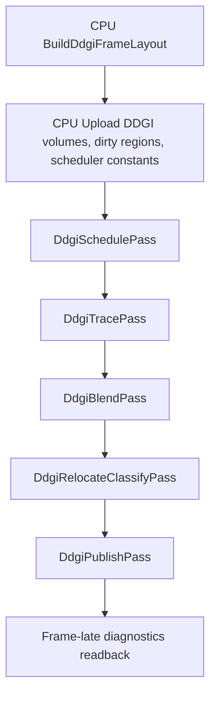

# DDGI GPU Probe Scheduling Implementation Plan

**Project:** `Belbertn/Njulf4.0`, `Simplified` branch  
**Area:** `Njulf.Rendering` DDGI probe update scheduling  
**Goal:** move the expensive per-probe DDGI scheduling work from CPU to GPU while keeping the CPU path as a validated reference and fallback.

---

## 1. Baseline and problem statement

The current performance snapshot shows that the renderer is CPU-bound before any reliable GPU timing can be evaluated.

| Metric | Snapshot value | Production implication |
|---|---:|---|
| CPU renderer frame | 91.309 ms | Far over the 6 ms CPU budget. |
| CPU DDGI scheduler | 67.303 ms | Dominant frame-time loss. |
| CPU DDGI scheduler P95 | 73.741 ms over 120 samples | Persistent, not a single-frame spike. |
| DDGI probe count | 23,040 | The scheduler is scanning a large probe set. |
| DDGI probes updated | 423 | Only 1.84% of probes become update requests. |
| Scheduled primary rays | 20,736 | Workload is already heavily budgeted. |
| GPU timing | pending / invalid | Do not make final GPU-budget claims until timestamps are valid. |

The key production problem is that the CPU spends tens of milliseconds deciding which few hundred probes to update. The GPU should instead generate the DDGI update queue directly and feed the existing DDGI compute passes without same-frame CPU readback.

Current code path:

```text
VulkanRenderer.DrawScene
  -> PrepareDdgiProbeVolumes(scene, camera, sceneData, lightSnapshot, cameraCut)
       -> BuildDdgiFrameLayout(...)
       -> _ddgiProbeVolumeManager.Upload(layout, ...)
       -> _ddgiGatherTileManager.Upload(layout, ...)
       -> _ddgiProbeVolumeManager.ScheduleProbeUpdates(...)
       -> _ddgiProbeVolumeManager.UploadScheduledProbeUpdateQueue(...)
  -> _renderGraph.Execute(...)
       -> DdgiTracePass
       -> DdgiBlendPass
       -> DdgiRelocateClassifyPass
       -> DdgiPublishPass
```

Current scheduler hotspot:

```text
DdgiProbeVolumeManager.ScheduleProbeUpdates(...)
  stopwatch start
  DdgiProbeUpdateScheduler.BuildRequests(...)
  stopwatch stop -> LastSchedulerMicroseconds / SchedulerP95Microseconds
```

The scheduler currently performs CPU-side probe selection phases such as dirty clipmap requests, dirty-region requests, uninitialized clipmap requests, frustum-focused requests, safety-shell requests, and round-robin refresh. The expensive phases scan probes and build sorted candidate queues.

---

## 2. Target architecture

### 2.1 CPU/GPU responsibility split

Keep this work on CPU:

- DDGI quality tier and settings resolution.
- Camera-relative clipmap layout construction.
- Scene/light/material/VFX dirty-source detection.
- Dirty-region list construction.
- Resource lifetime, capacity decisions, and fallback policy.
- Frame-late diagnostics readback.
- CPU reference scheduler for validation and fallback.

Move this work to GPU:

- Per-probe eligibility tests.
- Per-probe view/dirty/age/variance/confidence scoring.
- Priority bucketing.
- Request queue compaction.
- Request budget and primary-ray budget enforcement.
- Per-volume scheduled counts.
- Indirect dispatch arguments for DDGI trace/update work.
- Scheduler diagnostics counters.

### 2.2 New frame flow



### 2.3 First production principle

**Never read the GPU-generated schedule back to CPU in the same frame.**

Same-frame readback would replace a 67 ms CPU algorithm with a CPU/GPU synchronization bubble. `DdgiTracePass` must consume the GPU-written queue and count directly, preferably through GPU-written counters or indirect dispatch arguments.

---

## 3. Implementation phases

## Phase 0 — Baseline, guardrails, and feature flags

### Objective

Make the migration safe, measurable, and reversible before changing the scheduling path.

### Steps

1. Add a scheduler mode enum to `GlobalIlluminationSettings` in `RenderSettings.cs`:

   ```csharp
   public enum DdgiSchedulerMode : uint
   {
       CpuReference = 0,
       Gpu = 1,
       CpuGpuCompare = 2
   }
   ```

2. Add settings:

   ```csharp
   public DdgiSchedulerMode DdgiSchedulerMode { get; set; } = DdgiSchedulerMode.CpuReference;
   public bool DdgiGpuSchedulerReadbackValidationEnabled { get; set; }
   public int DdgiGpuSchedulerMaxDirtyRegions { get; set; } = 1024;
   public int DdgiGpuSchedulerCandidateBucketCount { get; set; } = 16;
   public bool DdgiGpuSchedulerFallbackOnValidationFailure { get; set; } = true;
   ```

3. Preserve `DdgiProbeUpdateScheduler.BuildRequests(...)` as the canonical CPU reference implementation. Do not delete or simplify it during this migration.

4. Add phase-level timing to the CPU scheduler before moving work to GPU:

   - `AddClipmapDirtyRequests`
   - `AddDirtyRegionRequests`
   - `AddUninitializedClipmapRequests`
   - `AddFrustumFocusedRequests`
   - `AddSafetyShellRequests`
   - `AddRoundRobinRequests`
   - candidate queue insertion count
   - max candidate queue shift count

5. Extend diagnostics:

   ```text
   DdgiSchedulerMode
   CpuDdgiSchedulerPhaseClipmapDirtyMicroseconds
   CpuDdgiSchedulerPhaseDirtyRegionsMicroseconds
   CpuDdgiSchedulerPhaseUninitializedMicroseconds
   CpuDdgiSchedulerPhaseFrustumMicroseconds
   CpuDdgiSchedulerPhaseSafetyMicroseconds
   CpuDdgiSchedulerPhaseRoundRobinMicroseconds
   CpuDdgiSchedulerCandidateInsertCount
   CpuDdgiSchedulerCandidateMaxShiftCount
   ```

6. Add a perf snapshot assertion helper for local testing:

   - fail if `CpuDdgiSchedulerMicroseconds > 2000` in GPU mode after warmup;
   - warn if `GpuTimingValid == 0`, but do not fail GPU scheduler work solely for pending timestamps;
   - fail if `DdgiSchedulerP95OverBudget == 1` after GPU scheduler is enabled and warmed up.

### Exit criteria

- CPU reference path still produces the same scheduling output as before.
- New settings serialize and survive default construction.
- Performance snapshots include the new scheduler mode and phase counters.
- No behavior changes when `DdgiSchedulerMode == CpuReference`.

---

## Phase 1 — GPU scheduler resource model

### Objective

Add the buffers and descriptors required for GPU scheduling without changing scheduling behavior yet.

### New GPU buffers

Add these to `DdgiProbeVolumeManager` or a dedicated `DdgiGpuSchedulerResources` helper owned by it.

| Buffer | Lifetime | Usage | Notes |
|---|---|---|---|
| `DdgiSchedulerConstantsBuffer` | per-frame or persistent ring | storage/uniform | Settings, budgets, camera/view context, active probe count, dirty region count. |
| `DdgiDirtyRegionBuffer` | dynamic | storage read | GPU representation of `layout.DirtyRegions`. |
| `DdgiProbeCandidateBuffer` | persistent, capacity = active probe cap | storage read/write | One candidate record per active probe, or compact candidate records. |
| `DdgiSchedulerGroupCountBuffer` | persistent | storage read/write | Per-workgroup, per-priority counts for deterministic compaction. |
| `DdgiSchedulerPrefixBuffer` | persistent | storage read/write | Prefix offsets for buckets/workgroups. |
| `DdgiSchedulerCounterBuffer` | persistent, ringed readback copy | storage read/write/transfer-src | Request count, primary ray count, overflow counters, per-priority counts. |
| `DdgiTraceIndirectDispatchBuffer` | persistent | indirect buffer + storage write | Dispatch args for trace/update. |
| Existing `DdgiProbeUpdateQueueBuffer` | persistent | storage read/write | Reuse as final GPU-written request queue. |

### Required struct layout

Create CPU and shader-mirrored structs. Use explicit sizes and alignment comments.

```csharp
public struct GPUDdgiSchedulerConstants
{
    public uint ActiveProbeCount;
    public uint VolumeCount;
    public uint RequestBudget;
    public uint PrimaryRayBudget;
    public uint DirtyRegionCount;
    public uint PriorityBucketCount;
    public uint FrameIndex;
    public uint Flags;

    public Vector4 CameraPositionNearPlane;
    public Vector4 ForwardFarPlane;
    public Vector4 RightTanHalfFovX;
    public Vector4 UpTanHalfFovY;
    public Vector4 CameraVelocitySafetyRadius;

    public float FrustumPriorityWeight;
    public float NewProbeUpdateBoost;
    public float OutOfFrustumMinimumUpdateFraction;
    public float Reserved0;
}
```

```csharp
public struct GPUDdgiDirtyRegion
{
    public Vector4 MinReason;
    public Vector4 MaxPadding;
}
```

```csharp
public struct GPUDdgiSchedulerCounters
{
    public uint RequestCount;
    public uint PrimaryRayCount;
    public uint CandidateCount;
    public uint OverflowCount;
    public uint DuplicateRequestCount;
    public uint BudgetRejectedCount;
    public uint InvalidProbeCount;
    public uint DirtyRegionCount;
    public uint VisibleFrustumCount;
    public uint SafetyShellCount;
    public uint AgeRefreshCount;
    public uint HighVarianceCount;
    public uint LowConfidenceCount;
    public uint StableSkippedCount;
    public uint Reserved0;
    public uint Reserved1;
}
```

### Bindless/descriptor work

1. Extend `BindlessIndex` or pass-local descriptor bindings for:

   - scheduler constants;
   - dirty regions;
   - candidate buffer;
   - group count/prefix buffers;
   - scheduler counters;
   - indirect dispatch buffer.

2. Prefer pass-local descriptor sets if `DdgiSchedulePass` already has a pass descriptor pattern. Prefer bindless only if DDGI probe resources are already accessed that way.

3. Ensure buffer usage flags include all required usages:

   ```text
   StorageBufferBit
   TransferDstBit where CPU uploads initial data
   TransferSrcBit where diagnostics readback is needed
   IndirectBufferBit for the trace dispatch args buffer
   ```

4. Add capacity checks:

   - active probes must not exceed `GlobalIlluminationSettings.AbsoluteDdgiMaxActiveProbeBudget`;
   - dirty regions must clamp to `DdgiGpuSchedulerMaxDirtyRegions` and increment an overflow counter;
   - candidate buffer capacity must be at least active probe count;
   - request queue capacity must be at least `min(activeProbeCount, DdgiMaxProbeUpdatesPerFrame)`.

### Exit criteria

- All buffers are created, named, tracked in memory diagnostics, and destroyed cleanly.
- CPU reference scheduling still runs.
- Validation layers report no descriptor, usage flag, alignment, or lifetime errors.
- Performance snapshots expose scheduler resource sizes.

---

## Phase 2 — Render graph and pipeline scaffolding

### Objective

Add a no-op `DdgiSchedulePass` into the render graph before DDGI trace work.

### Steps

1. Create a new pass class:

   ```text
   Njulf/Njulf.Rendering/Pipeline/DdgiSchedulePass.cs
   ```

2. Add a shader entry point:

   ```text
   Njulf/Njulf.Shaders/Compute/ddgi_schedule_reset.comp
   Njulf/Njulf.Shaders/Compute/ddgi_schedule_score.comp
   Njulf/Njulf.Shaders/Compute/ddgi_schedule_prefix.comp
   Njulf/Njulf.Shaders/Compute/ddgi_schedule_compact.comp
   Njulf/Njulf.Shaders/Compute/ddgi_schedule_finalize.comp
   ```

   The first PR may compile only `ddgi_schedule_reset.comp` and run as a no-op clear.

3. Insert `DdgiSchedulePass` immediately before `DdgiTracePass` in the production pipeline declaration.

   Target pass order:

   ```text
   ...
   ForwardPlusPass
   DdgiSchedulePass
   DdgiTracePass
   DdgiBlendPass
   DdgiRelocateClassifyPass
   DdgiPublishPass
   SkyboxPass
   ...
   ```

4. Declare render graph resources:

   ```text
   DdgiSchedulePass:
     Reads:
       SceneSubmissionBuffers, if trace scheduling needs scene submission metadata
     ReadWrites:
       DdgiProbeResources
   ```

5. Add explicit barriers:

   ```text
   DdgiSchedulePass -> DdgiTracePass
     srcStage  = ComputeShader
     srcAccess = ShaderStorageWrite
     dstStage  = ComputeShader
     dstAccess = ShaderStorageRead | ShaderStorageWrite
   ```

6. Mark `DdgiSchedulePass` as compute-only and async-compute candidate, but keep actual async disabled initially.

7. Add GPU timestamp labels:

   ```text
   GpuDdgiScheduleMicroseconds
   GpuDdgiTraceMicroseconds
   GpuDdgiBlendMicroseconds
   GpuDdgiRelocateClassifyMicroseconds
   GpuDdgiPublishMicroseconds
   GpuDdgiUpdateMicroseconds = schedule + trace + blend + relocate/classify + publish
   ```

   Keep a separate aggregate if you want the old `GpuDdgiUpdateMicroseconds` to remain trace/blend/relocate/publish only:

   ```text
   GpuDdgiTotalMicroseconds
   ```

### Exit criteria

- Render graph diagnostics show `DdgiSchedulePass` before `DdgiTracePass`.
- The pass can clear counters and indirect args without changing visible output.
- CPU reference queue is still used by `DdgiTracePass`.
- GPU timestamp plumbing reports the schedule pass once timestamps become valid.

---

## Phase 3 — GPU scheduling algorithm v1

### Objective

Move the dominant per-probe eligibility and selection work to compute while preserving the CPU scheduler as fallback.

### Recommended production algorithm

Avoid unordered global append as the default production path. It is easy to write, but hard to validate because the request order can vary between vendors and runs. Use a deterministic two-level compaction design.

#### Pass A — reset

`ddgi_schedule_reset.comp`

- Clear scheduler counters.
- Clear per-priority/per-workgroup counts.
- Clear indirect dispatch args.
- Optionally clear first few debug slots.

#### Pass B — score and count

`ddgi_schedule_score.comp`

- One thread per active probe.
- Decode volume and logical cell.
- Evaluate:
  - current frustum;
  - expanded frustum;
  - predicted frustum;
  - safety shell;
  - dirty-region intersection;
  - uninitialized cell;
  - age refresh;
  - high variance;
  - low confidence;
  - stable-probe skip.
- Write a compact `GPUDdgiProbeCandidate` for each eligible probe, or write metadata to a per-probe candidate array.
- Increment only per-workgroup local bucket counts written to `DdgiSchedulerGroupCountBuffer`.

Candidate record:

```csharp
public struct GPUDdgiProbeCandidate
{
    public uint ProbeIndex;
    public uint VolumeIndex;
    public uint Priority;
    public uint ReasonFlags;
    public int LogicalCellX;
    public int LogicalCellY;
    public int LogicalCellZ;
    public uint PrimaryRayCost;
    public uint ScoreKey;
    public uint Reserved0;
}
```

`ScoreKey` should be quantized. Do not require exact CPU floating-point sort equivalence.

#### Pass C — prefix buckets

`ddgi_schedule_prefix.comp`

- Prefix sum `groupBucketCounts[group][bucket]` into group offsets.
- Compute bucket base offsets.
- Clamp total candidate capacity.
- Write overflow counters if candidates exceed buffer capacity.

This can be a small compute pass because the number of workgroups and buckets is limited.

#### Pass D — compact candidates

`ddgi_schedule_compact.comp`

- Re-run or read per-probe candidate metadata.
- Use bucket/group offsets to write candidates into `DdgiProbeCandidateBuffer` in deterministic bucket order and mostly stable probe-index order.
- Do not yet enforce the final request budget here unless the implementation can do so deterministically.

#### Pass E — finalize requests

`ddgi_schedule_finalize.comp`

- Walk compacted candidates by priority bucket.
- Enforce:
  - `RequestBudget`;
  - `PrimaryRayBudget`;
  - no duplicate probe index;
  - valid volume index;
  - valid logical cell;
  - queue capacity.
- Write final `GPUDdgiProbeUpdateRequest` records into the existing DDGI update queue buffer.
- Write:
  - request count;
  - primary ray count;
  - per-priority counts;
  - per-volume counts;
  - indirect dispatch args for `DdgiTracePass`.

### Why this design

- It keeps CPU layout and dirty-region systems intact.
- It avoids same-frame readback.
- It avoids a full GPU sort.
- It avoids nondeterministic global append as the long-term default.
- It gives stable validation invariants.
- It scales with active probe count better than the current CPU scan and insertion-sorted candidate queue.

### Initial simplification allowed

For the first working prototype, `ddgi_schedule_finalize.comp` may run in one workgroup and scan all candidates. That is acceptable because 23,040 candidate records on GPU is small compared with 67 ms of CPU work. Optimize finalize only after timestamps show it matters.

### Exit criteria

- GPU mode writes a valid update queue.
- `DdgiTracePass` consumes the GPU-written queue without CPU upload.
- No same-frame readback exists in the GPU path.
- Counts satisfy:

  ```text
  RequestCount <= DdgiProbeUpdateRequestBudget
  PrimaryRayCount <= DdgiProbeUpdatePrimaryRayBudget
  RequestCount <= DdgiMaxProbeUpdatesPerFrame
  all ProbeIndex < DdgiActiveProbeCount
  no duplicate ProbeIndex in final queue
  all VolumeIndex < DdgiProbeVolumeCount
  ```

---

## Phase 4 — Integrate GPU queue consumption into DDGI trace

### Objective

Stop uploading a CPU-generated request queue when GPU scheduling is enabled.

### Steps

1. Update `VulkanRenderer.PrepareDdgiProbeVolumes(...)`:

   ```csharp
   if (Settings.GlobalIllumination.DdgiSchedulerMode == DdgiSchedulerMode.CpuReference)
   {
       int scheduledProbeUpdates = _ddgiProbeVolumeManager.ScheduleProbeUpdates(...);
       _ddgiProbeVolumeManager.UploadScheduledProbeUpdateQueue(...);
       sceneData.DdgiProbesUpdated = scheduledProbeUpdates;
   }
   else
   {
       _ddgiProbeVolumeManager.PrepareGpuScheduleInputs(layout, sceneData, ...);
       sceneData.DdgiProbesUpdated = _ddgiProbeVolumeManager.LastCompletedGpuSchedule.RequestCount;
       sceneData.DdgiScheduledPrimaryRayCount = _ddgiProbeVolumeManager.LastCompletedGpuSchedule.PrimaryRayCount;
   }
   ```

2. In GPU mode, `PrepareGpuScheduleInputs(...)` should upload only:

   - volume metadata, as today;
   - dirty regions;
   - scheduler constants;
   - optional feedback state if it is not already in probe state buffers.

3. Skip `UploadScheduledProbeUpdateQueue(...)` in GPU mode.

4. Update `DdgiTracePass` so it reads:

   - final request queue buffer;
   - scheduler counter buffer;
   - indirect dispatch args buffer.

5. Prefer `vkCmdDispatchIndirect` for trace work if the trace shader can be organized around request count.

6. If indirect dispatch is too large a refactor for v1, dispatch a fixed upper bound and early-out in shader:

   ```glsl
   uint requestIndex = gl_GlobalInvocationID.x;
   if (requestIndex >= schedulerCounters.RequestCount) return;
   ```

   This is acceptable for first production rollout if the dispatch bound is capped by `DdgiMaxProbeUpdatesPerFrame`, not active probe count.

7. Add a render graph barrier between schedule and trace.

8. Add readback copies only into a multi-frame diagnostics ring:

   ```text
   Frame N: GPU writes schedule counters
   Frame N+1/N+2: CPU reads completed counters if available
   ```

### Exit criteria

- GPU mode has no CPU upload of `GPUDdgiProbeUpdateRequest`.
- Trace pass uses GPU-produced count/queue.
- Diagnostics are frame-late but stable.
- CPU reference mode remains unchanged.

---

## Phase 5 — Compare mode and correctness validation

### Objective

Prove that the GPU scheduler is correct enough for production before making it the default.

### Compare mode behavior

When `DdgiSchedulerMode == CpuGpuCompare`:

1. Run CPU reference scheduler.
2. Run GPU scheduler.
3. Use either CPU queue or GPU queue based on a temporary setting:

   ```csharp
   public bool DdgiCompareModeUseGpuQueueForRendering { get; set; }
   ```

4. Read back GPU queue and counters frame-late.
5. Compare invariants, not exact order.

### Required validation checks

Frame-level checks:

- request count within budget;
- primary-ray count within budget;
- no duplicate probe index;
- no invalid volume index;
- no invalid logical cell;
- no request for inactive probe;
- no zero-ray request;
- per-volume counts add up to total count;
- reason counters add up or are at least internally consistent.

CPU/GPU comparison checks:

- GPU request count within ±10% of CPU reference for stable camera frames, unless CPU is known to rely on exact floating-point scoring.
- GPU primary-ray count within budget and within ±10% of CPU reference when budgets are not saturated.
- Top-priority classes present when expected:
  - new cells after teleport/large scroll;
  - dirty bounds after material/transform/light changes;
  - visible frustum during normal movement;
  - safety shell when out-of-frustum quota is enabled;
  - high variance / low confidence when feedback flags are present.
- No severe visual divergence after warmup.

### Test scenes

Add deterministic test scenes or scripted camera paths:

1. Static camera, no dirty regions.
2. Slow camera movement.
3. Fast camera movement.
4. Teleport / camera cut.
5. Large clipmap scroll.
6. Directional light change.
7. Local light add/remove/change.
8. Emissive material change.
9. Geometry moved across probe cells.
10. Low primary-ray budget stress.
11. Low request budget stress.
12. Dirty-region overflow stress.
13. Max active probes stress.
14. DDGI disabled / ray query unavailable fallback.

### Exit criteria

- Validation counters stay zero across test scenes after warmup.
- Differences between CPU and GPU output are understood and documented.
- GPU mode can be rendered for extended camera paths without leaks, duplicate requests, invalid requests, or visible cache corruption.

---

## Phase 6 — Adaptive budget feedback

### Objective

Make the existing adaptive budget system work with GPU scheduling and frame-late timing.

### Current behavior to preserve

The CPU scheduler calculates adaptive budgets from:

- max probe updates per frame;
- active probe count;
- cold-start request budget;
- primary-ray budget;
- cold-start primary-ray budget;
- minimum refresh frames;
- max shaded lights;
- DDGI time budget;
- hysteresis;
- emergency degrade multiplier;
- previous GPU update time;
- previous budget scale;
- whether previous timing was estimated.

### GPU mode changes

1. Keep adaptive budget selection on CPU for v1.
2. Use frame-late GPU DDGI timing once valid:

   ```text
   previousGpuUpdateMicroseconds = LastCompletedGpuDdgiTotalMicroseconds
   ```

3. If GPU timestamps are pending, use the existing estimate path, but mark diagnostics clearly:

   ```text
   DdgiAdaptiveBudgetReason = estimated-gpu-time
   ```

4. Add a scheduler-specific GPU time if available:

   ```text
   GpuDdgiScheduleMicroseconds
   GpuDdgiScheduleP95Microseconds
   GpuDdgiScheduleOverBudget
   ```

5. Never block CPU waiting for GPU timing.

6. Add separate budgets:

   ```csharp
   public float DdgiGpuScheduleTimeBudgetMilliseconds { get; set; } = 0.25f;
   public float DdgiGpuTotalUpdateTimeBudgetMilliseconds { get; set; } = 1.5f;
   ```

7. If scheduler GPU time exceeds budget for N frames:

   - reduce candidate scan frequency for far cascades;
   - reduce safety-shell quota;
   - lower request budget;
   - temporarily skip stable high-confidence probes;
   - never silently exceed primary-ray budget.

### Exit criteria

- Adaptive budget no longer stays permanently in estimated mode once GPU timestamps are valid.
- Budget reductions recover smoothly with hysteresis.
- Emergency degrade still halves effective shaded-light count when needed.
- No CPU stalls are introduced by timing readback.

---

## Phase 7 — Diagnostics, snapshots, and debug tooling

### Objective

Make GPU scheduling observable enough to ship and maintain.

### Add diagnostics fields

Add to `RendererDiagnostics`, `RendererDiagnosticsSchema`, overlay snapshots, and performance snapshot writer:

```text
DdgiSchedulerMode
GpuDdgiScheduleMicroseconds
GpuDdgiScheduleP95Microseconds
GpuDdgiSchedulerCandidateCount
GpuDdgiSchedulerFinalRequestCount
GpuDdgiSchedulerPrimaryRayCount
GpuDdgiSchedulerOverflowCount
GpuDdgiSchedulerBudgetRejectedCount
GpuDdgiSchedulerDuplicateRejectedCount
GpuDdgiSchedulerInvalidProbeCount
GpuDdgiSchedulerDirtyRegionCount
GpuDdgiSchedulerReadbackLatencyFrames
GpuDdgiSchedulerValidationMismatchCount
GpuDdgiSchedulerValidationStatus
GpuDdgiSchedulerFallbackActive
GpuDdgiSchedulerFallbackReason
GpuDdgiSchedulerPriorityCounts[...]
GpuDdgiSchedulerVolumeCounts[...]
```

### Debug overlay additions

Add DDGI scheduler debug views:

- scheduled probes by priority;
- rejected probes by reason;
- dirty region bounds;
- primary-ray budget heatmap;
- cascade contribution;
- stale probes;
- low confidence / high variance probes;
- fallback status.

### Snapshot acceptance fields

Every performance snapshot should make these questions answerable:

- Is GPU or CPU scheduler active?
- How many probes were considered?
- How many candidates were generated?
- How many final requests were emitted?
- What rejected candidates and why?
- Did the request budget saturate?
- Did the primary-ray budget saturate?
- Was there overflow?
- Is the readback current or frame-late?
- Did validation fail?
- Did fallback activate?

### Exit criteria

- A single snapshot can explain scheduler behavior without a debugger.
- Debug overlay can prove which probes are scheduled and why.
- Validation/fallback status is visible in development builds.

---

## Phase 8 — Production fallback and failure policy

### Objective

Make GPU scheduling safe on unsupported devices, driver edge cases, validation failures, and resource pressure.

### Fallback rules

Automatically fall back to CPU reference scheduler if any of these are true:

- GPU scheduler setting is disabled.
- Required buffer allocation fails.
- Required Vulkan features are missing:
  - compute shaders;
  - storage buffers;
  - storage buffer atomics or equivalent algorithm support;
  - indirect dispatch if indirect mode is enabled.
- Shader compilation or pipeline creation fails.
- Validation detects invalid requests for more than a configurable threshold.
- Scheduler counters become impossible:
  - request count > queue capacity;
  - primary ray count > primary-ray budget;
  - duplicate request count > 0 in final queue;
  - invalid probe count > 0.
- Device lost / swapchain rebuild path cannot reinitialize scheduler resources.

### Fallback behavior

- Log once with a stable reason code.
- Mark diagnostics:

  ```text
  GpuDdgiSchedulerFallbackActive = 1
  GpuDdgiSchedulerFallbackReason = "..."
  ```

- Continue rendering with CPU reference path.
- Do not toggle repeatedly every frame. Use hysteresis:

  ```text
  require 300 stable frames before trying GPU scheduler again in development;
  never auto-retry in shipping unless explicitly enabled.
  ```

### Exit criteria

- Any scheduler failure degrades to CPU reference, not a broken frame or device hang.
- Fallback can be forced by settings and by a test hook.
- Fallback state appears in diagnostics and snapshots.

---

## Phase 9 — Memory, resource lifetime, and synchronization hardening

### Objective

Ensure the implementation is safe under real production workloads.

### Memory rules

1. Use explicit capacity calculations.
2. Never allocate per frame outside existing staging/ring patterns.
3. Name all GPU allocations.
4. Track GPU scheduler memory in budget diagnostics.
5. Clamp all counts before buffer writes.
6. Treat buffer overflow as a recoverable diagnostic event.

### Synchronization rules

1. Use render graph barriers between all scheduler subpasses if they are represented as separate passes.
2. If subpasses are internal dispatches inside one `DdgiSchedulePass`, insert `vkCmdPipelineBarrier2` between dispatches where needed:

   ```text
   score -> prefix: shader storage write -> shader storage read/write
   prefix -> compact: shader storage write -> shader storage read/write
   compact -> finalize: shader storage write -> shader storage read/write
   finalize -> trace: shader storage write -> shader storage read/write + indirect command read
   ```

3. Do not enable true async compute until graphics-queue GPU mode is stable.
4. When async compute is later enabled:

   - add real queue ownership transfers;
   - add semaphores/timeline semaphores as appropriate;
   - prove overlap with GPU timestamps;
   - keep graphics-queue fallback.

### Resource lifetime rules

1. Recreate scheduler buffers when active probe capacity grows beyond current capacity.
2. Do not shrink every frame; shrink only on explicit quality-tier/resource reset.
3. Preserve buffers across frames to avoid allocator churn.
4. Reset counters every frame in GPU pass, not CPU memory.
5. Ensure readback buffers are ringed by frames-in-flight plus GPU timing latency.

### Exit criteria

- No validation errors under Vulkan validation layers.
- No resource leaks after repeated swapchain recreation.
- No per-frame persistent allocations in steady state.
- Device memory remains within budgeted expectations.

---

## Phase 10 — Testing strategy

### Unit tests

Add tests to `Njulf.Tests` for CPU-side configuration and scheduler invariants:

- default scheduler mode is CPU reference until intentionally changed;
- quality tiers still resolve existing DDGI budgets;
- dirty-region clamp behavior;
- adaptive budget behavior with frame-late timings;
- fallback reason priority;
- diagnostics serialization compatibility.

### GPU integration tests

Add a small test harness or sample-run validation mode that can run scripted frames and export snapshots.

Required test cases:

| Case | Expected result |
|---|---|
| DDGI disabled | GPU scheduler does not dispatch, counters are zero. |
| Ray query unsupported | CPU/GPU scheduler does not produce ray-update work. |
| Static scene | Stable request count, no invalid requests, no resource reinit. |
| Camera slow pan | Mostly visible-frustum requests. |
| Camera fast movement | far cascade throttling and near/current frustum preference. |
| Camera teleport | new-cell / teleport warmup requests. |
| Directional light changed | dirty/global update reasons appear. |
| Local light changed | local dirty region requests appear. |
| Emissive material changed | dirty/emissive requests appear. |
| Tiny request budget | final count respects request budget. |
| Tiny primary-ray budget | final primary rays respect ray budget. |
| Dirty region overflow | overflow counter increments, no crash. |
| Max active probes | no buffer overflow and acceptable GPU time. |
| Swapchain recreate | resources remain valid. |
| Device fallback forced | CPU scheduler takes over. |

### Visual validation

For each scripted camera path:

- capture with CPU scheduler;
- capture with GPU scheduler;
- compare final indirect lighting history after warmup;
- accept minor temporal differences but reject persistent holes, flicker, stale cells, or obvious cascade seams.

### Performance validation

Collect snapshots after warmup at 1080p development profile:

- CPU reference baseline;
- GPU scheduler graphics queue;
- GPU scheduler with validation readback disabled;
- GPU scheduler with validation readback enabled;
- later: async compute enabled, if supported.

### Exit criteria

- CPU scheduler cost in GPU mode is reduced to submission/input-prep overhead only.
- GPU scheduler output passes invariant validation.
- No visible DDGI regression across scripted scenes.
- Snapshots clearly report performance improvement and active scheduler mode.

---

## Phase 11 — Performance targets and production gates

### Initial performance target

For the current captured workload:

| Metric | Target after GPU scheduler v1 |
|---|---:|
| `CpuDdgiSchedulerMicroseconds` in GPU mode | <= 300 µs steady-state CPU prep/submit overhead |
| `CpuDdgiSchedulerP95Microseconds` in GPU mode | <= 500 µs after warmup |
| `GpuDdgiScheduleMicroseconds` | <= 250–500 µs target, validate with real timestamps |
| Final request count | <= request budget |
| Final primary-ray count | <= primary-ray budget |
| Invalid final requests | 0 |
| Duplicate final requests | 0 |
| GPU scheduler fallback | 0 in normal runs |

Do not enforce the GPU time target until `GpuTimingValid == 1` and timestamp frame latency is understood.

### Production readiness gates

A release candidate is ready only when all gates pass:

1. **Correctness gate**
   - No invalid requests.
   - No duplicate final requests.
   - No budget violations.
   - No persistent visual artifacts.

2. **Performance gate**
   - CPU scheduler hotspot removed.
   - GPU scheduler cost measured and within budget on target hardware.
   - No new CPU/GPU stalls.

3. **Stability gate**
   - 8-hour soak test with camera movement, scene changes, and swapchain recreation.
   - No memory leaks.
   - No device loss.
   - No validation errors.

4. **Fallback gate**
   - CPU fallback works.
   - Forced fallback works.
   - Validation-triggered fallback works.
   - Fallback diagnostics are clear.

5. **Observability gate**
   - Snapshot tells which scheduler ran.
   - Snapshot includes request, candidate, overflow, and validation counters.
   - Debug overlay can explain probe choices.

6. **Maintainability gate**
   - CPU reference remains available.
   - Shader structs are mirrored and documented.
   - Tests cover settings, budgets, and validation invariants.
   - Docs explain GPU scheduler modes and fallback behavior.

---

## Phase 12 — Suggested PR slicing

### PR 1 — Instrument CPU scheduler and add settings

Files:

```text
Njulf/Njulf.Rendering/Data/RenderSettings.cs
Njulf/Njulf.Rendering/Resources/DdgiProbeVolumeManager.cs
Njulf/Njulf.Rendering/Resources/DdgiProbeUpdateScheduler.cs
Njulf/Njulf.Rendering/Diagnostics/RendererDiagnostics*.cs
Njulf/Njulf.Tests/*
```

Deliverables:

- scheduler mode enum;
- phase timers;
- diagnostics fields;
- CPU path unchanged;
- tests for settings and diagnostics serialization.

Acceptance:

- current snapshot can identify which scheduler phase dominates;
- no rendering behavior change.

### PR 2 — Add GPU scheduler resources

Files:

```text
Njulf/Njulf.Rendering/Resources/DdgiProbeVolumeManager.cs
Njulf/Njulf.Rendering/Descriptors/BindlessIndex.cs or pass descriptors
Njulf/Njulf.Rendering/Memory/* if allocation helpers are needed
Njulf/Njulf.Rendering/Diagnostics/*
```

Deliverables:

- buffers allocated, registered, and destroyed;
- memory diagnostics;
- no-op upload of dirty regions/constants;
- CPU scheduler still active.

Acceptance:

- validation clean;
- no steady-state per-frame allocations.

### PR 3 — Add no-op `DdgiSchedulePass`

Files:

```text
Njulf/Njulf.Rendering/Pipeline/DdgiSchedulePass.cs
Njulf/Njulf.Rendering/Pipeline/ProductionRenderPipeline*.cs
Njulf/Njulf.Rendering/Pipeline/RenderGraph*.cs
Njulf/Njulf.Shaders/*ddgi_schedule_reset*
```

Deliverables:

- render graph pass inserted before trace;
- counter clear shader;
- GPU timestamp label;
- graph diagnostics include new pass.

Acceptance:

- output unchanged;
- barriers valid;
- pass can be toggled off.

### PR 4 — Implement GPU candidate scoring

Files:

```text
Njulf/Njulf.Shaders/*ddgi_schedule_score*
Njulf/Njulf.Rendering/Pipeline/DdgiSchedulePass.cs
Njulf/Njulf.Rendering/Resources/DdgiProbeVolumeManager.cs
```

Deliverables:

- per-probe candidate metadata;
- per-priority counts;
- no final queue consumption yet;
- frame-late diagnostics readback.

Acceptance:

- candidate counts are plausible;
- no buffer overflows;
- CPU path still renders.

### PR 5 — Implement compaction and final request queue

Files:

```text
Njulf/Njulf.Shaders/*ddgi_schedule_prefix*
Njulf/Njulf.Shaders/*ddgi_schedule_compact*
Njulf/Njulf.Shaders/*ddgi_schedule_finalize*
Njulf/Njulf.Rendering/Pipeline/DdgiSchedulePass.cs
Njulf/Njulf.Rendering/Resources/DdgiProbeVolumeManager.cs
```

Deliverables:

- final GPU request queue;
- counters;
- budget enforcement;
- diagnostics readback.

Acceptance:

- final GPU queue passes invariants;
- compare mode can read and inspect GPU results frame-late.

### PR 6 — Make `DdgiTracePass` consume GPU queue

Files:

```text
Njulf/Njulf.Rendering/Pipeline/DdgiTracePass.cs or equivalent DDGI trace implementation
Njulf/Njulf.Rendering/VulkanRenderer.cs
Njulf/Njulf.Rendering/Resources/DdgiProbeVolumeManager.cs
```

Deliverables:

- skip CPU schedule/upload in GPU mode;
- trace reads GPU queue/counter;
- fixed dispatch with shader early-out or indirect dispatch;
- CPU fallback preserved.

Acceptance:

- GPU mode renders DDGI using GPU-generated queue;
- no same-frame readback;
- CPU scheduler hotspot disappears in GPU mode.

### PR 7 — Compare mode and validation dashboard

Files:

```text
Njulf/Njulf.Rendering/Diagnostics/*
Njulf/Njulf.Rendering/Debug/*
Njulf/Njulf.Tests/*
```

Deliverables:

- CPU/GPU queue comparison;
- validation mismatch counters;
- debug overlay views;
- fallback-on-validation-failure.

Acceptance:

- scripted scenes pass validation;
- fallback activates cleanly when validation is forced to fail.

### PR 8 — Adaptive budget and production hardening

Files:

```text
Njulf/Njulf.Rendering/Resources/DdgiProbeVolumeManager.cs
Njulf/Njulf.Rendering/Data/RenderSettings.cs
Njulf/Njulf.Rendering/Diagnostics/*
```

Deliverables:

- frame-late GPU timing feedback;
- scheduler GPU time budget;
- recover/degrade hysteresis;
- robust fallback policy.

Acceptance:

- adaptive budget no longer depends indefinitely on estimated GPU time once timestamps are valid;
- budget changes are stable and visible in snapshots.

### PR 9 — Async compute readiness, not default enablement

Files:

```text
Njulf/Njulf.Rendering/Pipeline/RenderGraph*.cs
Njulf/Njulf.Rendering/Pipeline/DdgiSchedulePass.cs
Njulf/Njulf.Rendering/Pipeline/DDGI update passes
```

Deliverables:

- mark schedule/update chain as async-compatible;
- real queue ownership transition plan;
- GPU timing comparison graphics queue vs async queue.

Acceptance:

- async remains opt-in;
- graphics-queue path remains the default fallback;
- no async path is shipped without measured overlap benefit.

### PR 10 — Documentation and default rollout

Files:

```text
Njulf/Plans/*
README or renderer docs
Sample settings profiles
```

Deliverables:

- document scheduler modes;
- document fallback conditions;
- document diagnostics fields;
- set default mode per build/profile.

Suggested defaults:

```text
Development: CpuReference until GPU path passes validation, then Gpu with validation optional
CI validation: CpuGpuCompare on deterministic test scenes
Shipping: Gpu with fallback, validation readback off
Debug menu: allow toggling CpuReference/Gpu/CpuGpuCompare
```

Acceptance:

- engineers can diagnose scheduler behavior from docs and snapshots;
- production defaults are explicit and reversible.

---

## 13. Code touchpoint checklist

### `VulkanRenderer.cs`

- Branch `PrepareDdgiProbeVolumes(...)` by scheduler mode.
- Continue building CPU layout and dirty regions.
- Upload GPU scheduler inputs in GPU mode.
- Skip `ScheduleProbeUpdates(...)` and `UploadScheduledProbeUpdateQueue(...)` in GPU mode.
- Fill scene diagnostics from frame-late GPU scheduler readback.
- Keep CPU fallback path unchanged.

### `DdgiProbeVolumeManager.cs`

- Own GPU scheduler buffers and capacities.
- Upload dirty regions and scheduler constants.
- Expose buffer handles/descriptors to `DdgiSchedulePass`.
- Provide `LastCompletedGpuSchedule` diagnostics from ringed readback.
- Implement fallback reason tracking.
- Preserve CPU scheduler methods.

### `DdgiProbeUpdateScheduler.cs`

- Keep as CPU reference.
- Add instrumentation and optional debug export.
- Avoid refactoring it away until GPU mode has shipped and soaked.

### DDGI update passes

- Add `DdgiSchedulePass` before trace.
- Update trace to consume GPU-written request count/queue.
- Keep fixed-dispatch early-out as initial fallback if indirect dispatch refactor is risky.
- Later migrate to indirect dispatch.

### Render graph

- Add `DdgiSchedulePass` to production pass order.
- Mark it compute-only.
- Add barriers into trace.
- Add diagnostics for schedule pass resource access and queue intent.

### Diagnostics and snapshots

- Add scheduler mode, timings, counters, validation status, and fallback status.
- Add frame-late readback latency fields.
- Add performance budget status for GPU scheduler.

### Shaders

- Add scheduler reset, score, prefix, compact, finalize compute shaders.
- Mirror C# structs exactly.
- Use bounds checks on all buffer writes.
- Prefer deterministic two-level compaction over unordered global append.

### Tests

- Add unit tests for settings, budget, fallback, and diagnostics.
- Add scripted integration validation scenes.
- Add snapshot-based perf regression checks.

---

## 14. Key risks and mitigations

| Risk | Mitigation |
|---|---|
| GPU scheduling output differs from CPU exact order | Compare invariants and visual results, not exact floating-point order. Keep CPU reference. |
| Same-frame readback creates stalls | Use GPU queue/counters directly; read diagnostics frame-late only. |
| GPU atomics create nondeterministic ordering | Use two-level bucket/count/prefix/compact flow for production. |
| Dirty-region overflow drops important updates | Clamp with diagnostics; prioritize higher-severity dirty reasons; optionally reserve emergency dirty budget. |
| GPU scheduler becomes GPU bottleneck | Add GPU timestamps, budget feedback, far-cascade throttling, and optional range-limited enumeration. |
| Async compute adds synchronization bugs | Ship graphics-queue GPU scheduler first; make async a later opt-in phase. |
| Unsupported devices fail | Feature-gated CPU fallback with clear reason. |
| Debug readback hides performance gains | Validation readback is optional, frame-late, and disabled in shipping. |
| Resource lifetime bugs during swapchain recreation | Make scheduler resources persistent and independent of swapchain size where possible; add swapchain recreation tests. |
| Maintenance burden from duplicated CPU/GPU logic | Treat CPU as reference and shader as production implementation; document shared formulas and add compare-mode tests. |

---

## 15. Final production definition of done

The GPU DDGI scheduler is production-ready when:

- The CPU scheduler hotspot is removed in GPU mode.
- DDGI still converges visually across static, moving, dirty, and teleport scenarios.
- The final request queue never violates request or primary-ray budgets.
- There are no invalid or duplicate final requests.
- No same-frame CPU readback exists in the GPU path.
- Diagnostics clearly report scheduler mode, timings, counts, overflow, validation, and fallback.
- CPU reference fallback remains available and tested.
- The implementation is validation-layer clean.
- The system survives long soak tests, swapchain recreation, and forced fallback.
- GPU timestamps show scheduler cost is acceptable on target hardware before making GPU scheduling the default.
